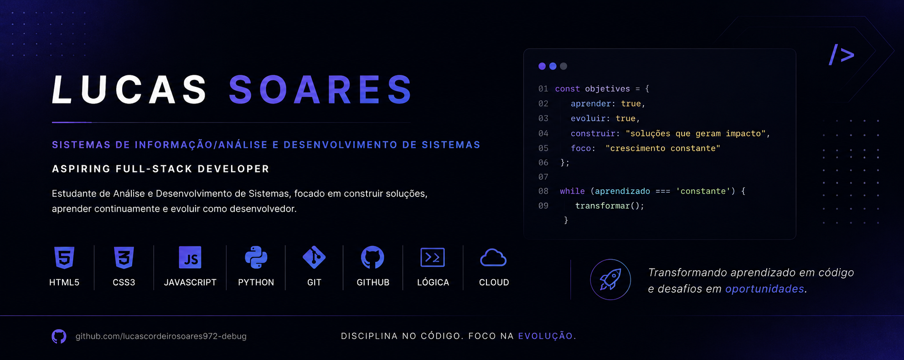

  

# 👋 Olá, eu sou o Lucas

Sou estudante de Análise e Desenvolvimento de Sistemas (ADS) e estou em constante aprendizado na área de tecnologia.  
Atualmente estou focado em construir uma base sólida em desenvolvimento web e boas práticas de programação.

---

## 🎯 Objetivo

Busco minha primeira oportunidade de estágio na área de Tecnologia da Informação, onde eu possa aprender na prática, evoluir minhas habilidades e contribuir com o time.

---

## 📚 Em aprendizado atualmente

- HTML e CSS (fundamentos e estruturação de páginas)
- JavaScript (lógica e interatividade)
- Python (lógica de programação e introdução ao back-end)
- Git e GitHub (controle de versão)
- Conceitos básicos de front-end

---

## 🚀 Em desenvolvimento

Estou praticando pequenos projetos para fixar o aprendizado e melhorar minha lógica de programação e organização de código.

---

## 💡 Sobre mim

Gosto de aprender coisas novas, sou dedicado e busco evoluir constantemente, tanto na área acadêmica quanto prática.

---

## 📌 Status

📖 Estudando e construindo minha base em desenvolvimento web  
🎯 Foco atual: aprendizado + prática consistente
